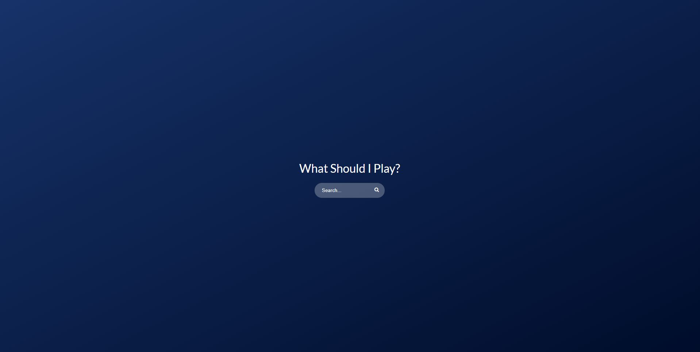
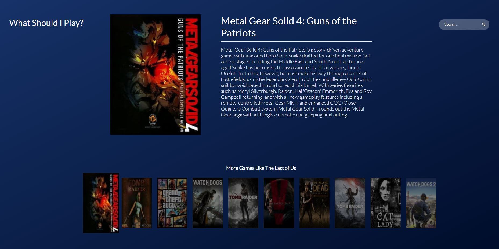

This project was bootstrapped with [Create React App](https://github.com/facebook/create-react-app).

## Game Suggestion Lookup

Game Suggestion Lookup is a project that gives you suggestions about what games to play based on a game you like. It uses [IGDB's](https://api.igdb.com) API to return a list of ten games that are similar to the searched game. Each game has a title and a quick summary.

## Motivation

I created this project so I could practice integrating Redux into React.

## Code Style

This project uses ESLINT and Prettier, to lint and style code.

## Screenshots & Gifs





## Tech used

[IGDB API](https://api.igdb.com)

[CREATE REACT APP](https://github.com/facebook/create-react-app)

[REDUX](https://github.com/reduxjs/redux)

[NODE JS](https://nodejs.org/en/)

## Getting it running

Because the IGDB API does not support CORS under their free tier there is no production build at this time. In order to run this on your local machine, get an [API Key](https://api.igdb.com/signup) and then create a local environment file like so ...

### .env.local

```
REACT_APP_API_KEY=INSERT_KEY_HERE
REACT_APP_API_URL=/
```

then to run the local server type in

```
npm start
```

## Improvements to be made

- Make site more friendly to differing display sizes
- Create backend API to get around CORS issue for production build

## License

MIT
